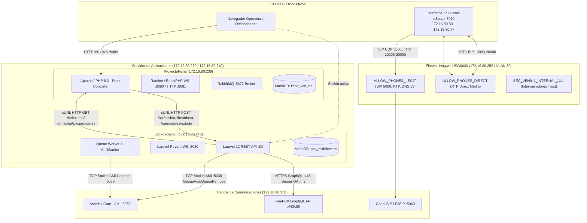
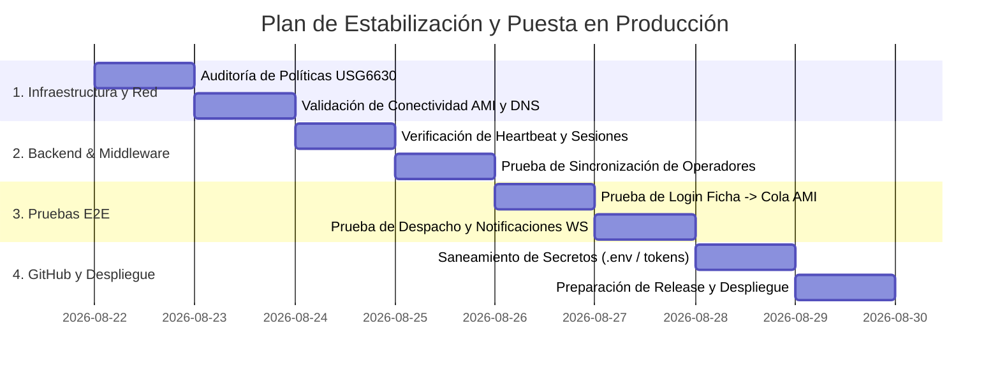

# DOCUMENTO TÉCNICO DE ARQUITECTURA, DEPENDENCIAS E INTEGRACIÓN
## Proyecto VEN 9-1-1: ProyectoFicha, pbx-receptor, FreePBX y Firewall Huawei USG6630

---

## 1. RESUMEN EJECUTIVO Y MAPA GENERAL

El ecosistema del VEN 9-1-1 está compuesto por **dos subsistemas de software autónomos pero interconectados** (`ProyectoFicha` y `pbx-receptor`), que interactúan estrechamente con la central telefónica **FreePBX**, la infraestructura de telefonía física (**teléfonos IP Huawei eSpace 7950**) y el firewall perimetral y switch núcleo **Huawei USG6630**.

---

## 2. ANÁLISIS EXPLORATORIO DE CÓDIGO (FASE 1)

### 2.1. ProyectoFicha
* **Lenguaje:** PHP 8.1 / 8.2 nativo + JavaScript (ES6+).
* **Arquitectura:** Modelo-Vista-Controlador (MVC) artesanal con Front Controller (`index.php`), Autoload SPL, RBAC dinámico con inercia cero y Servicios desacoplados (`app/Servicios/`).
* **Punto de Entrada:** `index.php` (ruteo mediante `?url=controlador/metodo/parametro`).
* **Módulos y Servicios Clave:**
  * `AuthControlador.php`: Gestiona login/logout de operadores, dispara eventos telefónicos a `pbx-receptor` vía `PbxApiService`, y expone endpoints proxy (`estadoPbx`, `heartbeatPbx`).
  * `FichaApiControlador.php`: Endpoint seguro `GET index.php?url=fichaApi/operadores` protegido por Bearer Token compartido para que `pbx-receptor` sincronice operadores activos.
  * `PbxApiService.php`: Cliente cURL HTTP hacia `http://172.16.80.240/api/` con timeouts cortos (5s) y tolerancia a fallos.
  * `servidor_ws.php`: Demonio WebSocket Ratchet en puerto `8080` (clientes web) y servidor HTTP React en puerto `8081` (mensajes internos).
  * `consumidor_notif.php`: Demonio PHP que consume la cola `notificaciones` de RabbitMQ (puerto `5672`) y las despacha al servidor WebSocket.
* **Base de Datos:** MariaDB / MySQL (`ficha_ven_911`), 22 tablas relacionales con soporte UTF-8 MB4.
* **Variables de Entorno:** `DB_HOST`, `DB_NAME`, `DB_USER`, `DB_PASS`, `PBX_API_URL`, `PBX_API_TOKEN`, `PBX_API_ENABLED`, `PBX_COLA_DEFAULT`.

### 2.2. pbx-receptor
* **Lenguaje:** PHP 8.2 / 8.3 + JavaScript.
* **Framework:** Laravel 12.x.
* **Arquitectura:** REST API Backend / Middleware de Cómputo Telefónico con servicios modulares (`AmiService`, `TelefoniaService`, `FreePbxService`, `IntelligenceService`).
* **Punto de Entrada:** `public/index.php` (vía `routes/api.php` y `routes/web.php`).
* **Módulos y Servicios Clave:**
  * `TelefoniaController.php`: Procesa endpoints `/api/sesion`, `/api/heartbeat`, `/api/operadores/estado`, `/api/status`, `/api/log`.
  * `AmiService.php`: Cliente socket TCP usando la librería `PAMI` para enviar acciones `QueueAdd`, `QueueRemove`, `ExtensionState`, `QueueStatus` a Asterisk (`172.16.80.250:5038`).
  * `FreePbxService.php`: Cliente HTTP GraphQL / OAuth2 Token para consultar extensiones y estado general de FreePBX vía HTTPS.
  * `AmiMonitorCommand.php`: Demonio de consola (`artisan ami:monitor`) que mantiene un socket abierto persistente escuchando eventos AMI (`Hangup`, `QueueCallerAbandon`) para cálculo de métricas y detección de fugas.
  * `TelefoniaService.php`: Asignación dinámica 1:1 o pool de extensiones a operadores según su usuario de Ficha (`ficha_username`).
* **Base de Datos:** MariaDB (`pbx_middleware`), tablas `operador_configs`, `operador_sessions`, `extensions`, `bitacora_ami`, `historial_accesos`, `alertas_productividad`, `api_error_logs`, `log_api_receptors`.
* **Variables de Entorno:** `ASTERISK_HOST`, `ASTERISK_PORT`, `ASTERISK_USER`, `ASTERISK_SECRET`, `FREEPBX_URL`, `FREEPBX_CLIENT_ID`, `FREEPBX_CLIENT_SECRET`, `FICHA_API_URL`, `FICHA_API_TOKEN`, `AMI_DRY_RUN`.

---

## 3. MAPA DE COMUNICACIONES Y DEPENDENCIAS (FASES 2 Y 3)

| Origen | Destino | Protocolo / Transporte | Puerto | Endpoint / Recurso | Datos Transmitidos | Respuesta Esperada | Comportamiento ante Fallo |
| :--- | :--- | :--- | :--- | :--- | :--- | :--- | :--- |
| **Operador (JS)** | `ProyectoFicha` | HTTP POST | TCP 80 | `index.php?url=auth/authenticate` | Credenciales (`usuario`, `password`) | JSON `{success: true, pbx_activo: bool}` | Muestra error en UI. |
| `ProyectoFicha` | `pbx-receptor` | HTTP POST (cURL) | TCP 80 | `/api/sesion` | `{usuario, evento: 'LOGIN', nombre, cedula, cola}` | JSON `{ok: true, data: {extension, ami_status}}` | Ficha no se bloquea; registra `pbx_error` en log y permite sesión web. |
| `ProyectoFicha` | `pbx-receptor` | HTTP POST (cURL) | TCP 80 | `/api/heartbeat` | `{ficha_username: 'jsoto'}` | JSON `{ok: true, message: 'Heartbeat received'}` | Si da 404, Ficha intenta reautenticar automáticamente al operador. |
| `ProyectoFicha` | `pbx-receptor` | HTTP POST (cURL) | TCP 80 | `/api/operadores/estado` | `{ficha_username: 'jsoto'}` | JSON `{success: true, data: {extension, estado}}` | Widget PBX en Ficha muestra badge "Desconectado". |
| `pbx-receptor` | `ProyectoFicha` | HTTP GET | TCP 80 / 8080 | `index.php?url=fichaApi/operadores` | Headers `Authorization: Bearer <token>` | JSON `{success: true, data: [operadores]}` | `pbx-receptor` usa base local de operadores como fallback. |
| `pbx-receptor` | `FreePBX (Asterisk)` | TCP Socket | TCP 5038 | Action: `QueueAdd` / `QueueRemove` | Interfaz PJSIP/ext, Cola (ej. `0911`), Penalidad | `Response: Success / Error` | Registra fallo en `bitacora_ami` y desasigna extensión localmente. |
| `pbx-receptor` | `FreePBX Core` | HTTPS / HTTP | TCP 443 / 80 | `/admin/api/api/gql` (GraphQL) | Query GraphQL + Bearer Token OAuth2 | JSON Data `{fetchAllExtensions}` | Se marca FreePBX offline en caché por 60s para no saturar. |
| **Teléfono IP** | `FreePBX Core` | SIP (UDP) | UDP 5060 | Señalización SIP REGISTER / INVITE | Credenciales SIP, Códecs, SDP | SIP `200 OK` / `100 Trying` / `180 Ringing` | Teléfono muestra "Reintentando..." en pantalla. |
| **Teléfono A** | **Teléfono B** | RTP (UDP) | UDP 10000-20000 | Flujo de audio bidireccional | Paquetes de voz codificados (G.711 / G.729) | Paquetes RTP bidireccionales continuos | Silencio total o audio en una sola vía (unidireccional). |

### Respuestas a Preguntas de Dependencia Crítica:
1. **¿ProyectoFicha depende directamente de pbx-receptor?**
   * *No de forma bloqueante.* ProyectoFicha está diseñado con *fail-soft*: si `pbx-receptor` está caído, el usuario de Ficha puede iniciar sesión, registrar y despachar incidencias, mostrando un aviso visual de que la telefonía no se pudo conectar.
2. **¿pbx-receptor depende de ProyectoFicha?**
   * *Sí para los eventos de sesión.* `pbx-receptor` es un receptor pasivo: no fuerza login si Ficha no le envía la notificación HTTP. Sin embargo, puede operar de forma autónoma para monitoreo de llamadas si `AmiMonitor` está activo.
3. **¿Comparten base de datos?**
   * *No.* `ProyectoFicha` usa `ficha_ven_911` y `pbx-receptor` usa `pbx_middleware`. El desacoplamiento es total a nivel de persistencia.
4. **¿Qué ocurre si FreePBX se cae?**
   * Las llamadas telefónicas se detienen. `pbx-receptor` captura las excepciones en los sockets AMI y marca la central como offline sin tumbar los servidores web.
5. **¿Qué ocurre si pbx-receptor se cae?**
   * Los operadores en Ficha siguen operando el sistema web, pero no ingresan dinámicamente a las colas de llamadas telefónicas de Asterisk al hacer login.

---

## 4. INTEGRACIÓN CON FREEPBX Y VOIP (FASE 4)

1. **Protocolo de Señalización:** SIP sobre UDP puerto `5060` (PJSIP driver en Asterisk).
2. **Protocolo de Medios (Audio):** RTP sobre UDP en el rango `10000 - 20000`.
3. **Mecanismo de Cola y Miembros:** Asterisk utiliza **miembros dinámicos** (`QueueAdd` / `QueueRemove` vía AMI). No requiere extensiones estáticas en `/etc/asterisk/queues.conf`.
4. **Direct Media:** Configurado para que el flujo RTP viaje directamente entre teléfonos IP sin triangular por el servidor Asterisk una vez establecida la llamada (`ALLOW_PHONES_DIRECT`).
5. **Mecanismos de Integración utilizados:**
   * **AMI (Asterisk Manager Interface):** Puerto TCP `5038` (Activo y esencial).
   * **GraphQL / REST OAuth2:** Puertos TCP `443`/`80` (Sincronización de metadatos de extensiones).
   * **ARI / AGI:** No se utilizan actualmente en el código.

---

## 5. CORRELACIÓN CON EL FIREWALL HUAWEI USG6630 (FASE 5)

| Origen | Destino | Protocolo | Puerto | Función | Política Firewall | Estado | Inspección / Restricciones |
| :--- | :--- | :--- | :--- | :--- | :--- | :--- | :--- |
| `172.16.80.50-77` (Teléfonos) | `172.16.80.250` (FreePBX) | UDP | 5060 | Registro SIP | `ALLOW_PHONES_LEGIT` | **PERMIT** | SIP ALG desactivado (`undo firewall detect sip`). QoS 2 Mbps. |
| `172.16.80.50-77` (Teléfonos) | `172.16.80.250` (FreePBX) | UDP | 10000-20000 | Audio RTP con PBX | `ALLOW_PHONES_LEGIT` | **PERMIT** | QoS 10 Mbps garantizados (`PROF_QOS_RTP` DSCP 46). |
| `172.16.80.50-77` (Teléfonos) | `172.16.80.50-77` (Teléfonos) | UDP | 10000-20000 | Audio Direct Media | `ALLOW_PHONES_DIRECT` | **PERMIT** | Crítico: No inspeccionar con NAT. |
| `172.16.80.50-77` (Teléfonos) | `172.16.80.1` | UDP | 53 | Consultas DNS | `ALLOW_PHONES_LEGIT` | **PERMIT** | Evita bloqueo en arranque de teléfonos eSpace 7950. |
| `172.16.80.50-77` (Teléfonos) | Cualquier otro destino | CUALQUIERA | CUALQUIERA | Aislamiento Zero-Trust | `BLOCK_PHONES_ANY` | **DENY** | Bloquea salida a internet y escaneos de red local. |
| `172.16.80.239` (Ficha) | `172.16.80.240` (pbx-receptor) | TCP | 80 / 8080 | API REST / WebSockets | `SEC_VEN911_INTERNAL_ALL` | **PERMIT** | Comunicación Intra-Zona `trust`. |
| `172.16.80.240` (pbx-receptor) | `172.16.80.250` (FreePBX) | TCP | 5038 | Socket AMI Asterisk | `SEC_VEN911_INTERNAL_ALL` | **PERMIT** | Tráfico de control entre servidores en zona `trust`. |
| `172.16.80.240` (pbx-receptor) | `172.16.80.250` (FreePBX) | TCP | 443 / 80 | API GraphQL FreePBX | `SEC_VEN911_INTERNAL_ALL` | **PERMIT** | Tráfico HTTPS de gestión entre servidores. |

---

## 6. CLASIFICACIÓN DE RIESGOS TÉCNICOS (FASE 7)

### CRÍTICO (Prioridad 1)
1. **Riesgo:** Reactivación accidental de SIP ALG en el Firewall Huawei.
   * **Causa:** Actualización de firmware o reinicio de configuración de fábrica en el USG6630.
   * **Impacto:** Corrupción de cabeceras SDP, fallas masivas de registro SIP y llamadas mudas.
   * **Mitigación:** Documentar en el procedimiento de backup y verificar con `display firewall detect sip`.
2. **Riesgo:** Bloqueo de socket AMI por concurrencia descontrolada o timeout corto.
   * **Causa:** `AmiService` abre y cierra conexiones socket en cada petición si no se maneja pool o si la latencia sube por encima de `connect_timeout` (3s).
   * **Impacto:** Falla en el login del operador en colas telefónicas.
   * **Mitigación:** Implementar reintentos exponenciales y validación previa de socket.

### ALTO (Prioridad 2)
1. **Riesgo:** Sesiones "fantasma" (operador cerrado en Ficha pero activo en cola telefónica).
   * **Causa:** Cierre abrupto de navegador o caída de red sin ejecutar el evento de logout HTTP.
   * **Impacto:** Llamadas entrantes del 911 asignadas a un puesto vacío.
   * **Mitigación:** El comando `ClosePhantomSessionsCommand.php` y el mecanismo de `heartbeat` deben ejecutarse mediante Cron / Programador de tareas cada 1 a 2 minutos.

### MEDIO (Prioridad 3)
1. **Riesgo:** Discrepancia en IPs y puertos entre Docker Compose y XAMPP/Producción.
   * **Causa:** Docker Compose usa `172.16.80.239` y `172.16.80.240` en puertos mapeados específicos (`82:80`, `8082:8080`), mientras que en servidor de producción con interfaces dedicadas se usa puerto `80`.
   * **Mitigación:** Centralizar todas las URLs y puertos exclusivamente en variables `.env`.

---

## 7. PLAN DE ACCIÓN Y VALIDACIÓN PRIORIZADO (FASE 8 Y 10)

1. **Paso 1 (Conectividad & Firewall):** Comprobar que los puertos `5038` (AMI), `5060` (SIP), `10000-20000` (RTP), `80` (HTTP) y `8080` (WS) respondan sin bloqueos entre `.239`, `.240` y `.250`.
2. **Paso 2 (Validación de Servicios):** Comprobar que el demonio `AmiMonitor` y el worker de colas de `pbx-receptor` corran de forma continua sin saturar memoria.
3. **Paso 3 (Pruebas End-to-End):**
   * *Login de Operador:* Iniciar sesión con un usuario rol 2 (Operador) en `ProyectoFicha` y verificar en la consola de Asterisk (`asterisk -rx "queue show 0911"`) que el miembro `PJSIP/XXXX` aparezca activo.
   * *Recepción de Llamada:* Generar una llamada de prueba hacia la cola y comprobar que el teléfono del operador timbre y que el audio fluya en ambas direcciones.
   * *Logout de Operador:* Cerrar sesión en `ProyectoFicha` y confirmar que el miembro sea removido de la cola.
4. **Paso 4 (Saneamiento para GitHub):** Asegurar que todos los tokens JWT y contraseñas de bases de datos queden excluidos de Git mediante plantillas `.env.example`.
