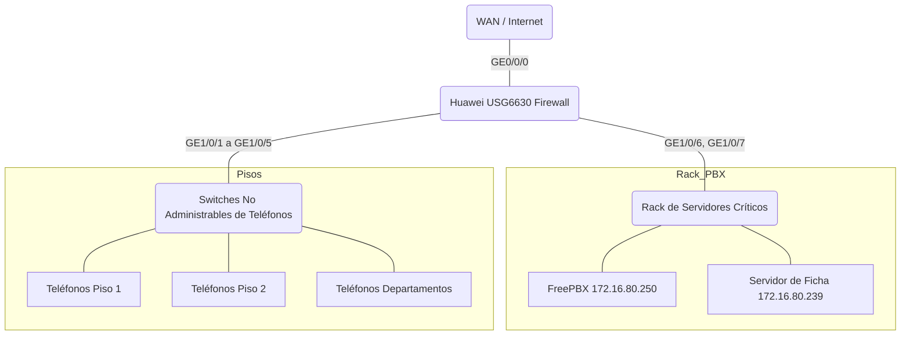

<br><br><br><br><br><br><br><br><br>
<h1 align="center">DOCUMENTACIÓN TÉCNICA Y OPERATIVA</h1>
<h2 align="center">Firewall Huawei USG6630</h2>
<h3 align="center">Infraestructura VoIP 911</h3>
<br><br><br><br><br>

* **Nombre del sistema:** Infraestructura de Seguridad Perimetral y Telefonía IP (VEN911)
* **Equipo principal:** Huawei Secospace USG6630
* **Propósito:** Brindar seguridad, aislamiento, segmentación Zero-Trust y Calidad de Servicio (QoS) a la telefonía de misión crítica.
* **Entorno:** Producción / Misión Crítica
* **Fecha de documentación:** 14 de Agosto de 2026
* **Versión del documento:** 1.0
* **Clasificación:** Documento interno / Infraestructura crítica
* **Estado:** Documento de referencia operacional

<div style="page-break-after: always"></div>

# 2. CONTROL DE VERSIONES

| Versión | Fecha | Autor | Descripción |
| :--- | :--- | :--- | :--- |
| 1.0 | 14/08/2026 | Infraestructura | Documentación inicial y auditoría Post-Despliegue QoS y Zero-Trust |

# 3. TABLA DE CONTENIDO

1. Introducción y Propósito del documento
2. Alcance
3. Resumen Ejecutivo
4. Arquitectura General
5. Topología Física
6. Topología Lógica
7. Direccionamiento IP
8. VLAN
9. Huawei USG6630
10. Interfaces
11. Zonas de Seguridad
12. Security Policies
13. Objetos y Grupos
14. Matriz de Puertos y Servicios
15. FreePBX
16. Flujo de una llamada
17. SIP y RTP
18. Calidad de Servicio (QoS)
19. Seguridad (SIP ALG y Segmentación)
20. Administración del Firewall
21. Comandos de diagnóstico rápido
22. Troubleshooting
23. Procedimiento de diagnóstico por capas
24. Backup, Restore y Rollback
25. Cambios Realizados y Problemas Históricos
26. Monitoreo y Mantenimiento
27. Seguridad Operacional
28. Checklist para un nuevo ingeniero
29. Matriz de Dependencias
30. Plan de Recuperación
31. Diagrama de Flujo de Telefonía
32. Recomendaciones futuras y Estado Actual
33. Resumen para el próximo administrador

<div style="page-break-after: always"></div>

# 4. RESUMEN EJECUTIVO

El Firewall **Huawei USG6630** actúa como el núcleo de seguridad y enrutamiento (Capa 3) para la infraestructura del centro de emergencias 911. Su propósito principal es proteger la central telefónica (FreePBX) y aislar a los teléfonos IP (Huawei eSpace 7950) de la red de datos tradicional y del acceso a internet, garantizando que un incidente de seguridad (virus, ramsomware) en la red de usuarios no afecte el servicio de telefonía crítica.

* **Impacto de falla:** La caída de este equipo detendría el enrutamiento SIP y RTP entre los switches de piso y el rack de servidores, dejando fuera de línea la telefonía del 911.
* **Composición:** El firewall maneja la segmentación L2/L3 (Switching y Routing), las Zonas de Seguridad y la Calidad de Servicio (QoS) que garantiza 10 Mbps exclusivos para la voz independientemente del tráfico de descargas del edificio.

Un ingeniero nuevo debe entender que **todo el flujo de voz pasa por este firewall**. Si hay problemas de llamadas, el diagnóstico debe centrarse en la tabla de sesiones (`display firewall session table`) del USG6630 antes de asumir fallas en los switches genéricos.

---

# 5. ARQUITECTURA GENERAL



---

# 6. TOPOLOGÍA FÍSICA

El equipo concentra los servidores físicamente, aislándolos de los switches de distribución.

| Puerto | Dispositivo | Función | VLAN | Zona | Estado |
| :--- | :--- | :--- | :--- | :--- | :--- |
| `GE0/0/0` | Router WAN | Conexión a Internet / Troncales Externas | N/A | `untrust` | UP |
| `GE1/0/1` | Switch Piso 2 | Teléfonos IP operativos (Piso 2) | 80 | `trust` | UP |
| `GE1/0/2` | Switch Piso 1 | Teléfonos IP operativos (Piso 1) | 80 | `trust` | UP |
| `GE1/0/3` | Switch Deptos | Teléfonos IP operativos (Departamentos) | 80 | `trust` | UP |
| `GE1/0/4` | Switch Deptos | Teléfonos IP operativos (Departamentos) | 80 | `trust` | UP |
| `GE1/0/5` | Switch Deptos | Teléfonos IP operativos (Departamentos) | 80 | `trust` | UP |
| `GE1/0/6` | FreePBX Core | Central Principal Telefónica Asterisk | 80 | `trust` | UP |
| `GE1/0/7` | Servidor de Ficha | Servidor de Ficha / Despacho 911 | 80 | `trust` | UP |

---

# 7. TOPOLOGÍA LÓGICA & 8. DIRECCIONAMIENTO IP

La red principal opera bajo la subred `172.16.80.0/24`.

| Red / Subred | VLAN | Gateway | Uso | DHCP | Observaciones |
| :--- | :--- | :--- | :--- | :--- | :--- |
| `172.16.80.0/24` | 80 | `172.16.80.1` | Telefonía (Trust) | Asumido por Firewall | Troncal de Voz Principal |
| `192.168.99.0/24` | 99 | `192.168.99.1` | Gestión NOC | Desconocido | Aislado para admins |
| `172.16.80.253` | 80 | N/A | **Firewall USG6630** | Estática | Interfaz Vlanif80 |
| `172.16.80.250` | 80 | `.1` | **FreePBX** | Estática | Servidor de llamadas SIP (GE1/0/6) |
| `172.16.80.77` | 80 | `.1` | Teléfono eSpace (Tech) | DHCP | Asignado |

---

# 9. VLAN

### VLAN 80
* **Propósito**: Aislar el tráfico de voz.
* **Funcionamiento**: Dado que los switches de acceso **no son administrables**, no procesan tramas etiquetadas por LLDP/CDP. Por lo tanto, los teléfonos reciben DHCP estándar en modo Access o requieren marcado manual 802.1Q en el dispositivo. Todas las bocas del USG6630 hacia los switches pertenecen a la VLAN 80 en modo Untagged/Access (Inferido) o Access.

---

# 10. HUAWEI USG6630

* **Modelo:** Huawei USG6630.
* **Versión VRP:** VRP (R) Software, Version 5.170 (USG6600 V500R001C60SPC300)
* **Firmware BootROM:** 202 May 31 2017
* **IP Administración:** 172.16.80.253
* **Qué hace:** Actúa como switch central L2 (comunicando los puertos `GE1/0/1` al `GE1/0/7` bajo la `Vlanif80`), como Gateway L3, y como Motor de Inspección L4-L7 asegurando Zero Trust en la telefonía mediante `security-policy`.

---

# 11. ZONAS DE SEGURIDAD

* **`trust` (Prioridad 85):** Contiene todas las interfaces de voz y servidores: `Vlanif80`, `GE0/0/0`, `GE1/0/1` al `GE1/0/5` (Teléfonos IP), `GE1/0/6` (FreePBX Core), `GE1/0/7` (Servidor de Ficha) y `Virtual-if0`. El tráfico intra-zona es explícitamente permitido mediante la regla `SEC_VEN911_INTERNAL_ALL`. **Crítico (ERR-007/ERR-008):** Las interfaces físicas L2 (portswitch) DEBEN pertenecer explícitamente a esta zona.
* **`untrust` (Prioridad 5):** Interfaz WAN (`GE0/0/0` cuando se configure para salida a Internet). Todo tráfico denegado por defecto.
* **`Trust_Tecnologia` (Prioridad 95):** Zona de gestión lógica para NOC (`Vlanif99`).

---

# 12. SECURITY POLICIES (POLÍTICAS DE SEGURIDAD)

> **Nota Crítica:** El firewall inspecciona incluso el tráfico que circula dentro de la misma zona (`trust`). Por defecto, Huawei bloquea la comunicación intra-zona. Por eso existen reglas explícitas.

| ID | Política | Acción | Propósito | Riesgo si se elimina |
|:---|:---|:---|:---|:---|
| 9 | `ALLOW_PHONES_LEGIT` | PERMIT | Permite tráfico DNS, SIP (UDP 5060) y RTP originado por teléfonos hacia `172.16.80.250` (FreePBX) y `.1`. | Caída total de telefonía. |
| 10 | `ALLOW_PHONES_DIRECT` | PERMIT | Autoriza audio Direct Media (RTP) entre extensiones internas (teléfono a teléfono). | Audio bidireccional cortado. |
| 11 | `BLOCK_PHONES_ANY` | DENY | Bloquea que los teléfonos se comuniquen a destinos no autorizados (ej. Internet, otras subredes). | Teléfonos expuestos a intrusiones. |
| 1 | `PERMIT_VOIP_INTERNAL` | PERMIT | Regla original de acceso SIP/RTP general. | Fallos en equipos no agrupados. |
| 6 | `PERMIT_TRUST_INTERNAL` | PERMIT | Permite comunicación libre entre puertos dentro de la zona `trust`. (Actualmente solapada por las restricciones). | Fallos L2. |

---

# 13. OBJETOS Y GRUPOS

### `GRP_ALL_PHONES` (Address-set)
* **Tipo:** Grupo de direcciones IP (`ip address-set GRP_ALL_PHONES type object`).
* **Miembros:** 25 direcciones IP confirmadas (`172.16.80.50` a `.77`).
* **Propósito:** Englobar todos los teléfonos para poder aplicarles políticas restrictivas (Security) y perfiles de ancho de banda garantizado (QoS) de manera centralizada. Agrupa a múltiples subgrupos locales como `GRP_LOC_SALA_DESPACHO` o `GRP_LOC_TECNOLOGIA`.

---

# 14. MATRIZ DE PUERTOS Y SERVICIOS

| Servicio | Protocolo | Puerto | Origen | Destino | Obligatorio |
| :--- | :--- | :--- | :--- | :--- | :--- |
| **SIP** | UDP | **5060** | Teléfonos | FreePBX (`.250`) | SÍ. Registro y señalización. |
| **RTP** | UDP | **10000 - 20000** | Teléfonos | FreePBX / Teléfonos | SÍ. Tráfico de voz / audio. |
| **DNS** | UDP | 53 | Teléfonos | GW (`.1`) / PBX (`.250`) | SÍ. Teléfonos fallan el registro si DNS falla por timeout. |
| **DHCP** | UDP | 67 / 68 | Teléfonos | Firewall | SÍ. Aprovisionamiento IP. |
| **NTP** | UDP | 123 | Teléfonos | FreePBX / Internet | SÍ. Fecha de equipos. |
| **Mngt** | TCP | 22 (SSH) | NOC (`Vlan99`) | Firewall (`.253`) | SÍ. Administración. |

---

# 15. FLUJO DE UNA LLAMADA Y RTP (DIRECT MEDIA)

```text
# SEÑALIZACIÓN (SIP UDP 5060)
Telefóno A (172.16.80.77) -----> [GE1/0/1 - Firewall - GE1/0/6] -----> FreePBX (172.16.80.250)
Telefóno A <----- [GE1/0/1 - Firewall - GE1/0/6] <----- FreePBX (172.16.80.250)

# AUDIO (RTP UDP 10000-20000) - DIRECT MEDIA (Confirmado por el usuario)
Teléfono A (172.16.80.77) <=====[Firewall (ALLOW_PHONES_DIRECT)]=====> Teléfono B (172.16.80.50)
```
* **Problema Típico:** Si SIP funciona pero no hay audio, el problema radica en el enrutamiento de RTP o en bloqueos en `ALLOW_PHONES_DIRECT`.

---

# 16. QOS (CALIDAD DE SERVICIO)

La telefonía crítica tiene prioridad estricta garantizada en memoria, independientemente de la congestión.

* **Perfil RTP (`PROF_QOS_RTP`)**: 10 Mbps Garantizados. Marcado activo de clase Expedited Forwarding (`DSCP 46`).
* **Perfil SIP (`PROF_QOS_SIP`)**: 2 Mbps Garantizados. Marcado `DSCP 26`.

**Aplicación (`traffic-policy`)**:
Las políticas `QOS_RTP_VOIP` y `QOS_SIP_VOIP` clasifican este tráfico proveniente de `GRP_ALL_PHONES` y le asignan el ancho de banda intocable.

---

# 17. SEGURIDAD ADICIONAL (SIP ALG)

**`undo firewall detect sip`**
Este comando fue aplicado de forma global. Huawei VRP posee una función llamada *SIP ALG* que inspecciona e intercepta los paquetes de voz para cambiar las cabeceras NAT. En esta infraestructura 911, los teléfonos y la PBX residen en redes planas enrutadas sin NAT.
* **Motivo:** SIP ALG modificaba corruptamente las cabeceras SDP, generando errores de registro (401 / 403 / Timeout).
* **Regla estricta:** NO reactivar SIP ALG.

---

# 18. COMANDOS DE DIAGNÓSTICO RÁPIDO VRP

**Ver sesiones activas de un teléfono (Crucial para ver qué puertos usa realmente):**
`display firewall session table verbose source global 172.16.80.77`

**Ver qué política de seguridad está bloqueando/permitiendo llamadas:**
`display security-policy rule all` (Busca la columna HITS, si sube, se está usando).

**Ver efectividad de Calidad de Servicio (QoS):**
`display traffic-policy rule all` (Busca que QOS_RTP_VOIP tenga HITS > 0 durante una llamada).

---

# 19. TROUBLESHOOTING DE TELEFONÍA

**Problema 1: Teléfono muestra "Reintentando..." en pantalla**
* **Diagnóstico:** El teléfono no llega a registrarse.
* **Causa Histórica:** El teléfono eSpace 7950 hace peticiones DNS a la IP del FreePBX (que no es DNS puro). Al no recibir respuesta, se bloquea. También ocurre si el puerto del USG6630 no pertenece a `trust`.
* **Solución:** Reconfigurar DNS del teléfono a `172.16.80.1` o `8.8.8.8` y verificar zonas (`display zone`).

**Problema 2: Teléfono registra pero el audio es mudo o unidireccional**
* **Diagnóstico:** RTP bloqueado.
* **Causa:** Regla `ALLOW_PHONES_DIRECT` o Asterisk operando fuera de 10000-20000 UDP.
* **Solución:** `display firewall session table | include UDP`.

---

# 20. PROCEDIMIENTOS: BACKUP, RESTORE Y ROLLBACK

### BACKUP
1. Ingresar por SSH.
2. Ejecutar `<USG6630-VEN911-CORE> save`. (Almacena en NVRAM `hda1:/vrpcfg.zip`).
3. Para exportar: Utilizar FTP/TFTP hacia una PC.

### ROLLBACK
Si un cambio rompe las llamadas, deshacer el comando en el contexto adecuado:
Ejemplo: `undo rule name BLOCK_PHONES_ANY` dentro de `security-policy`.

---

# 21. HISTORIAL DE PROBLEMAS Y CAMBIOS

* **14/08/2026 - Error Zonas**: Tráfico L2 bloqueado internamente. **Solución:** Interfaces agregadas explícitamente a zona `trust`.
* **14/08/2026 - SIP ALG Bug**: El firewall corrompía la señalización. **Solución:** `undo firewall detect sip`.
* **14/08/2026 - QoS y Zero-Trust**: Se desplegó exitosamente `PROF_QOS_RTP` (10 Mbps) y se bloqueó acceso LAN lateral (`BLOCK_PHONES_ANY`).

---

# 22. SEGURIDAD OPERACIONAL (REGLAS INTOCABLES)
1. **NO usar puertos ANY/ANY en políticas SIP/RTP.**
2. **NO reiniciar el USG6630 en horario operativo.** Aísla el puerto causante primero.
3. **NO modificar DNS en los teléfonos sin validar.**

---

# 23. RESUMEN PARA EL PRÓXIMO ADMINISTRADOR (HANDOVER)

Bienvenido. Administras el Firewall USG6630 que protege al ecosistema 911.

1. **¿Qué protege?** Toda la infraestructura de voz `172.16.80.0/24`. PBX en `.250` y firewall en `.253`.
2. **El "Truco" del Sistema:** Este Firewall actúa como un Switch y Router. No lo puentes; él garantiza **10 Mbps estrictos (QoS)** para que la voz no se corte.
3. **¿Qué NO debes tocar?** La política `ALLOW_PHONES_DIRECT` (Direct Media). Si la borras, las llamadas tendrán silencio bidireccional.
4. **Problemas Históricos**: El teléfono Huawei eSpace 7950 hace excesivas peticiones DNS al PBX, fallando el registro. Configura el gateway como DNS de los teléfonos.

*Fin del Documento Técnico.*
